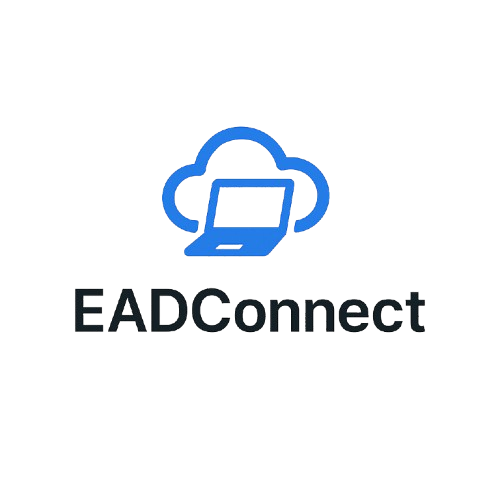

#  📚🔗 **EADConnect**  
### Uma ponte entre você e a plataforma de EAD do Grupo A Educação!



<a target="_blank">
    
</a>

---

### ✨ **Descrição**

O **EADConnect** é uma interface moderna e automatizada desenvolvida em Python que interage com a API da plataforma de educação a distância do Grupo A. Ele permite que você **baixe conteúdos, colete exercícios, salve dados em formatos estruturados (JSON, PDF)** e muito mais — tudo com poucos comandos.

💡 Ideal para estudantes, professores, desenvolvedores de automações educacionais e pesquisadores que desejam **facilitar o acesso e organização de conteúdos da plataforma**.

---

### 🚀 **Recursos**

O objetivo do **EADConnect** é simplificar o acesso e manuseio de dados da plataforma EAD, permitindo:

- 🔐 Autenticação e gerenciamento de sessões com a API
- 🧠 Cliente HTTP customizado com headers dinâmicos
- 📥 Coleta automatizada de exercícios de diferentes disciplinas
- 📄 Exportação em PDF e JSON
- 🗂️ Organização automática de arquivos
- 🧪 Testes e estrutura modular pronta para extensão
- 📦 Compactação automática em `.zip` dos materiais gerados
- 🧠 Organização de código modular e clara (config, auth, file_manager etc.)
- 🐍 Compatível com Python **3.12+**

---

### 📦 **Instalação com Poetry**

```bash
# Clone o repositório
git clone https://github.com/cleitonleonel/EADConnect.git
cd EADConnect

# Instale as dependências
poetry install
poetry self add poetry-plugin-shell

# Ative o ambiente virtual
poetry shell

# Rode o app
python main.py
```

---

### 🧭 **Estrutura do Projeto**

```
EADConnect/
├── eadconnect/
│   ├── http/
│   │   └── navigator.py
│   ├── services/
│   │   ├── academic_service.py
│   │   ├── notification_service.py
│   ├── utils/
│   │   ├── auth.py
│   │   ├── file_manager.py
│   │   ├── pdf.py
│   ├── client.py
│   ├── config.py
│   └── endpoints.py
├── src/
│   └── img/
│       └── logo.png
├── .gitignore
├── main.py
├── LICENSE
├── pyproject.toml
├── poetry.lock
└── README.md
```

---

## 🧪 Exemplos de Uso

```python
from eadconnect.client import EducationAPI
from eadconnect.utils.auth import authenticate
from eadconnect.utils.file_manager import save_exercise_data

client = EducationAPI("unidade_ensino", "username", "password")
client.access_token = authenticate(client)

exercises = client.get_exercises(course_id="123", topic_id="231")
save_exercise_data(exercises, "course_name", "231")
```

---

## 🤝 Contribuições

Sinta-se livre para abrir issues, enviar pull requests ou sugerir melhorias.  
Toda ajuda é bem-vinda! 💡

---

## 📝 Licença

Este projeto é licenciado sob a **MIT License**. Consulte o arquivo `LICENSE` para mais detalhes.

## 🧑‍💻 Desenvolvedor

Feito com 💙 por [Cleiton Leonel Creton](https://www.linkedin.com/in/cleiton-leonel-creton-331138167/)  
📫 cleiton.leonel@gmail.com  
🐙 [GitHub](https://github.com/cleitonleonel) | 📱 [WhatsApp](https://wa.me/5527995772291?text=Ol%C3%A1%2C+vim+pelo+seu+projeto+EADConnect+e+gostaria+de+falar+com+voc%C3%AA!)

